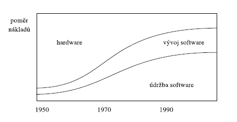
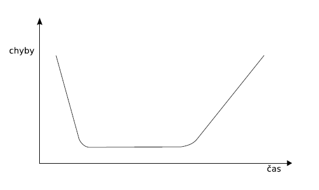
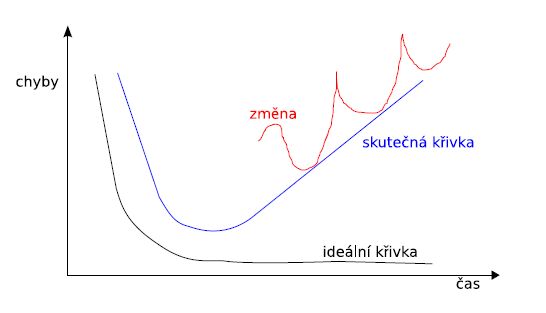
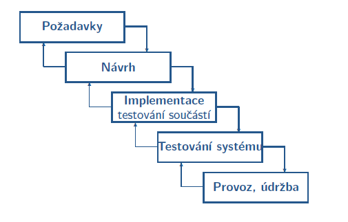

- 20.09.2021

- Organizace předmětu:
    - body na cvičeních jsou za aktivitu
    - Domácí úkol (12 bodů):
        - ER diagram se probírá na 3. přednášce a 2. cvičení, bude z něho domácí úkol; podobný diagram bude na zkoušce
    - Týmový projekt (16 bodů):
        - Komplexní model IS
        - 4 nebo 5 členů
        - 40 variant zadání
    - Zkouška:
        - musím získat minimálně 30 bodů, < 30 = 0
        - max 60
    - úspěšnost v předmětu cca 70% xd
    - https://www.fit.vutbr.cz/study/courses/IUS/private/

# Co je to SW inženýrství

- systematický přístup k vývoji, nasazení a údržbě SW
- inženýrská disciplína zabývající se praktickými problémy vývoje rozsáhlých SW systémů

### Proč vytváříme SW

- zlepšení služeb (Informační systémy)
- snížení nákladů (automatizace výroby)
- nemožnost řešení bez použití PC (předpověď počasí...)

- je nutné zlepšovat vlastnosti SW, hlavně jeho spolehlivost, bezpečnost a použitelnost
- je potřeba zvyšovat produktivitu vývoje SW

#### **Poměr nákladů při vývoji SW**

### Počátek SW inženýrství

- 60\. léta 20. stol.
- začaly se projevovat problémy při vývoji větších SW projektů
- SW krize se projevovala (a stále projevuje)
    - prodlužováním a prodražováním projektů
    - nízkou kvalitou výsledného produktu
    - problematickou údržbou a inovacemi
    - špatnou produktivitou práce programátorů
    - řada projektů končila neúspěchem
- probíhaly první pokusy s metodickým přistupem k prg - strukturované programování

- průměrný projekt oproti původnímu plánu (studie z roku 1995):
    - stál o 89% více
    - trval 2,2x déle
    - poskytoval pouze 61% funkčnosti

### <u>Problémy při vývoji SW</u>

- **Složitost** - žádné dvě části nejsou stejné, je zdrojem dalších problémů jako třeba komunikace v týmech...
- **Přizpůsobivost** - když se něco změní, měl by se přizpůsobit SW a ne user
- **Nestálost** - mění se okolí a mění se i SW, přibývají poždavky na starý SW, ten přežívá HW
- **Neviditelnost** - neexistuje přijatelný způsob reprezentace SW výrobku, který by pokral vššchny aspekty, ani nejsme určit, co v dané prezentaci chybí

*Problémy, které se nemusí projevit vždy:*
- **Práce v týmu** - problémy s organizací velkých SW projektů, plánováním...
    - vždy by měl být jeden šéf, který nedělá prakticky nic, jen si udržuje přehled kdo co reálně dělá xd
- **Nízká znovupožitelnost SW** - většina věcí se nikdy nepoužije znovu a tvoří se stále dokola
- **Problém míry** - metody použitelné u menších projektů se u velkých použít nedají
- **Tvorba dokumentace** - tvorba dokumentace je podobná tvorbě vlastního programu
    - problémy s aktualizací dokumentace vzhledem ke změnám v SW
    - problémy s konzistencí a úplností SW
- **Chyby v SW** - hodně chyb se projeví až při provozu SW
    - odstraňování chyb vede k návratu v etapách vývoje SW
- **Stárnutí SW** - nastupují nové standardy, přidávají se nové a nové funkce k SW, který na to již ale není přizpůsoben -> vede k degradaci a snižování spolehlivosti SW

#### **Typická chybová křivka HW**

#### **Typická chybová křivka SW**

- **Specifikace požadavků** - problematická komunikace se zákazníkem (uživatelem)
    - nejasná specifikace požadavků, spojená s neúplnou představou uživatele o výsledném produktu
    - *Tvorba SW je tvůrčí proces, nelze jej vyrábět*

### Příčiny zastavení SW projektů
- neúplnost nebo nejasnost požadavků
- nedostatek zdrojů (malý rozpočet a krátké termíny)
- nedostatečné plánívání
- malá podpora od vedení dodavatele nebo odběratele
- vyvíjený systém už není potřeba
- ...

### <u>Rozvoj SW inženýrství</u>
- Výzkum programovací aktivit
    - uvědomnění si lidského faktoru, práce v týmu
    - podpora řízení tvorby SW
    - modulární programování
    - návrhové vzory
- Výzkum metodik
    - vnímání životního cyklu SW
    - výzkum modelovacích jazyků (dnes UML)
- Zabezpečení kvality
    - testování, formální ověřování
- Metody návrhu založeného na modelech
    - transformace modelů na program

### <u>Metodiky vývoje SW</u>
- Metodiky
    - disciplinovaný proces nad vývojem SW s cílem zajistit tento vývoj více predikovatelný a srozumitelný
    - zahrnuje proces vývoje, nástroje, způsoby použití, využití, plánování...

**Terminologie**
- *Metoda* - postup pro dosažení určitého cíle
- *Metodika* - souhrn doporučených praktik a postupů
- *Metodologie* - nauka o metodách, jejich tvorbě a využití

### <u>SW produkt</u>
**Program**
- funkční část produktu
**SW produkt** - sbírka programů, procedur, pravidel... a s nimi spojená dokumentace

**Aktéři při vývoje SW**
- zákazník
- dodavatel
- uživatel

### <u>Typy SW produktů</u>
**Generické**
- krabicový SW, prodává se komukoli
- musí bát velmi důkladně otestován, protože odstranění chyby by bylo velmi drahé vzhledem k velkému rozšíření
**Zákaznické**
- SW na objednávku
- cena je výrazně vyšší oproti generickému SW

### <u>Proces vývoje SW</u>
Proces, ve kterém:
- se potřeby uživatele trasformují na požadavky na SW
- požadavky se trasformují na konkrétní návrh
- návrh se implementuje
- testuje
- a nakonec předá uživateli

**Životní cyklus SW** - rozděluje proces vývoje SW na několik období
- analýza a specifikace požadavků (8%)
    - transformace neformálních požadavků zákazníka do strukturovaného popisu požadavků
    - soustředit se na požadavky uživatele, ne na realizaci
    - analýza rizik, specifikace požadavků
    - plánování testování
- architektonický a podrobný návrh (7%)
    - 
- implementace (12%)
- integrace a testování (6%)
- provoz a údržba (67%)

### Model životního cyklu SW
- definuje jednotlivé etapy vývoje SW a jejich časovou následnost
- pro každou etapu definuje nutné činnosti
- pro každou etapu definuje její vstupy a výstupy
- nedefinuje déklu jednotlivých kroků a jejich rozsah
- každá etapa vytváří reálné výstupy
- správnost každé etapy lze vyhodnotit

#### **Vodopádový model životního cyklu SW**
- životní cyklus kde postupně od první etapy k poslední
- umožňuje návrat k předchozí etapě

- Vlastnosti
    - lineární model, intenzivně se používal v 70. letech
    - cílem bylo zavést nějaký řád do vývoje SW
- Výhody
    - při stálých požadavcích: nejlepší struktura výsledného produktu
    - jednoduchý na řízení
- Nevýhody
    - zákazník není (většinou) schopen přesně stanovit všechny požadavky předem
    - při změnách požadavků dlouhá doba realizace
    - zákazní vidí spustitelnou verzi až pozdě -> nedostatečná specifikace požadavků se projeví příliš pozdě

## Hlavní cíle SW inženýrství
- Management projektu
    - řízení životního cyklu projektu
    - dosažení požadovaného výsledku v požadovaném čase -> efektivní práce s časem a tedy i náklady
- Techniky
    - analýzy, návrhy, programování, testování...
- Vlastnosti SW inženýra
    - základní báze znalostí
    - schopnost tyto znalosti aplikovat
    - schopnost vyhledávat si nové informace
    - ...