- 27.09.2021

# Analýza a specifikace požadavků

## Pojmy
- stakeholder - libovolná zainteresovaná strana v projektu (uživatel, zákazník, vývojář, tester, manažer...)
    - je důležité zapojit všechny stakeholders do procesu vývoje
    - když na někoho zapomeneme, tak to zdržuje vývoj projektu

## Typy požadavků
- **Obchodní požadavky (business objectives)**
    - pomáhá nám pochopit proč to zákazník potřebuje
    - zaměřeno na obchodní cíle (úspora nákladů a času)
- **Uživatelské požadavky (user requirements)**
    - úlohy které  uživatel se systémem provádí
        - co je možné se systémem dělat
    - dost často se používá Use Case Diagram (UCD)
- **Funkční požadavky (functional requirements)**
    - jakým způsobem bude ten systém fungovat (jakým způsobem zjistí zda je něco na skladě...)
    - chování systému v různých podmínkách
    - diagram aktivit, vztahový diagram
- **Nefunkční požadavky**
    - požadavky na provoz systému
        - počet uživatelů, kolik má být systém schopen zvládnout (aby nespadnul)
    - počítačové vybavení (HW náročnost)
    - programové vybavení - oprační systém, programovací jayźyky...
    - vyvíjený software - efektivita, spolehlivost
    - legislativní požadavky
    - dodržování norem
- !požadavky musí být měřitelné!

## Metody získávání informací
### Interview
- základní požadavky, obchodní požadavky
- napřed orientační (první setkání, základní přehled...)
- poté strukturované (připravené otázky, získat hlubší představu)
- navrhovat alternativy
### Dotazníky
- velká skupina lidí
- dobře připravené otázky
- předem připravený způsob, jakým budu ty odpovědi vyhodnocovat
### Pracovní setkání
- skupina lidí (stakeholders) vyjednává o požadavcích a pracují společně na specifikaci požadavků
- menší skupiny jsou efektivnější
### Pozorování prací u zákazníka
- prostá specifikace nemusí být úplná
- umožňuje lépe pochopit aktivity a procesy, které nemusí být zřejmé každému
- časově náročné

## Problémy při specifikaci požadavků
### Přirozená neúplnost a nepřesnost
- nejasná nebo neúplná formulace požadavků zákazníkem
- neucelená představa uživatele o výsledném produktu
- pro komunikaci se používá přirozený jazyk, který je nejednoznačný

### Nedostatek znalostí
- vývojář se neorientuje v dané oblasti a nezná terminologii a všechny problémy, které mohou nastat
- zákazník se neorientuje v problematice vývoje SW

### Nekonzistence požadavků
- různí uživatelé mají různé požadavky a priority
- požadavky jsou mnohdy rozporné

#### **Zapojení uživatelů do vývoje**
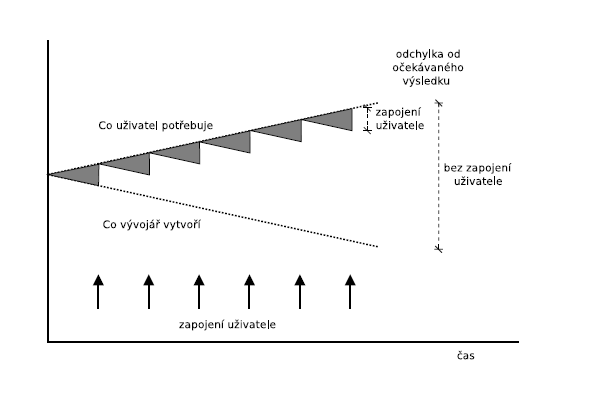

### **Postup při specifikaci požadavků**
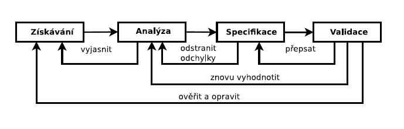

## Prototypování
### Motivace
- uživatelé mají možnost upravit a více specifikovat své požadavky v rané fázi vývoje projektu
- může nastínít různé alternativy návrhu

### Prototyp
- částečná implementace produktu
- prezentuje vnější rozhraní systému
- je implementován rychle bez důrazu na kvalitu programování či chování systému
- po vyjasnění specifikace by se měl zahodit, protože je špatně navrhnutý, udržovatelný...

#### **Prototypování**
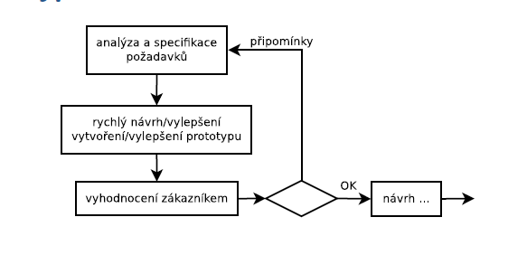

## Dobrá specifikace požadavků:
### Seřazeno podle důležitosti
- poznačit datum vytvoření požadavku
- seskupení požadavků podle důležitosti
### Sledovatelná
- musí být jasný smysl požadavku
### Modifikovatelná
- struktura a styl specifikace je konzistentní => snadné úpravy a doplňování požadavků
### Jednoznačná
- neumožňuje více interpretací, všechno psát srozumitelně a jednoznačně

### Specifikace by měla být:
- úplná - obsahuje všechno podstatné
- konzistentní - požadavek není v rozporu s jinými požadavky
- verifikovatelná - proces kontroly, zda SW splňuje požadavky

### Dobrá specifikace požadavků
- udržujte specfikaci čitelnou pro zákazníka
- ve specifikaci nanavrhujte řešení
- validujte požadavky
- zainteresujte uživatele 

#### **Cena chyb ve specifikaci**
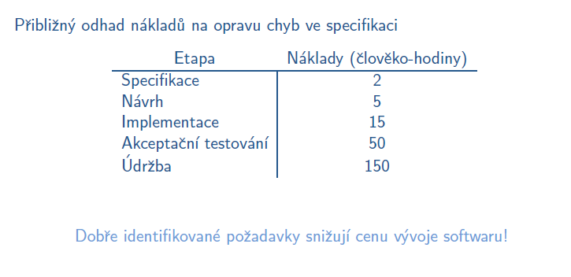

## Specifikace požadavků - Dokumentace
- dokumentace by měla být různorodá, od textu až po formální specifikace
- čím formálnější jazyk, tím horší je dokumentaci pochopit (je lepší používat nákresy, tabulky, vizualizace...)

# Specifikace požadavků - Modelování

## Modelování dat
- ER diagram - strukturovaný model dat
- Class diagram - objektově orientovaný model dat a protokolu (rozhraní zodpovědnosti)

### Modelování funkčních požadavků
- Data Flow Diagram (DFD) - specifikace chování systému
- Use Case Diagram (UCD) - diagram případů užití, spcifikuje možnosti použití systému

### **Diagram případů užití (UCD)**
- je potřeba najít účastníky a případy užití
- prvky diagramu užití
    - hranice systému
    - účastník (aktor) - subjekt, který se systémem pracuje
    - případ užití - funkce, kterou systém vykonává jménem jednotlivých účastníků, nebo v jejich prospěch
    - interakce - ukazuje účast aktora na provádění případu užití

#### **Příklad diagramu užití**
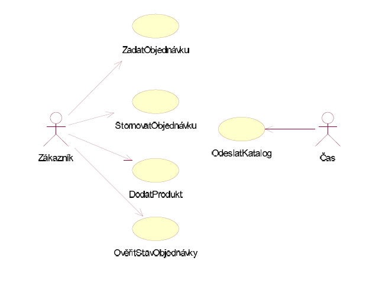

- *Pokročilé techniky UCD*
    - zobecnění účastníka
    - zobecnění příadu užití
    - relace <\<include>>
    - relace <\<extend>>
- pokročilé techniky spíš nepoužívat, protože může tak akorát dojít ke zmatení uživatele

#### **Diagram bez zobecnění účastníka VS s zobecněním**

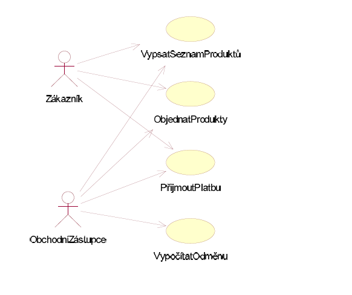
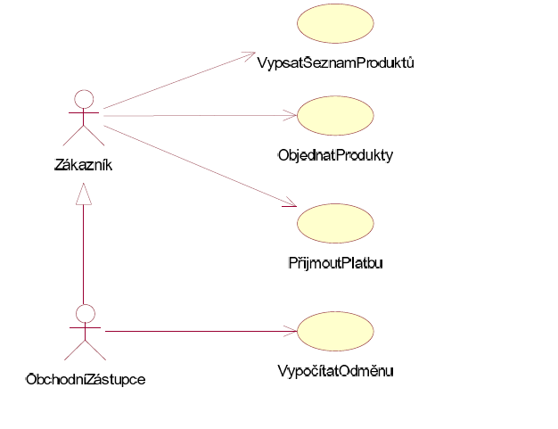

#### **Relace <\<include>>**
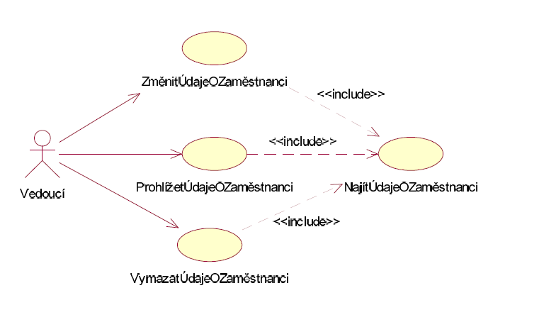

#### **Relace <\<extend>>**
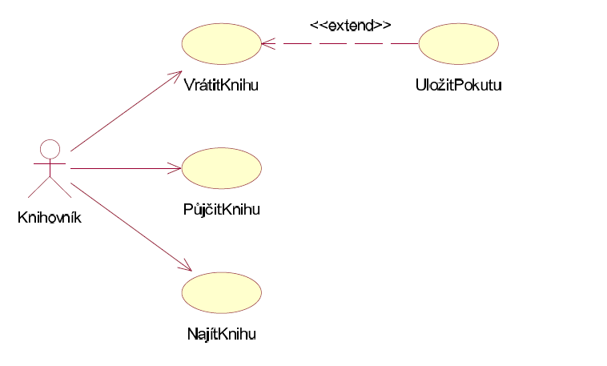

### **Diagram aktivit**
- reprezentuje objektově orientované diagramy
- modelování libovolných procesů, účastní se více objektů

*Využití diagramu aktivit*
- modelování scénářů případů užití
- modelování detailů operace nebo algoritmů
- modelování obchodního procesu
- prvky diagramu
    - uzly
        - akční uzly - modelují aktivitu
        - řídící uzly - modelují rozhodování, počáteční uzel, koncový uzel
        - objektové uzly - modelují objekty podílející se na aktivitách
    - hrany
        - řídící hrany - modelují přechody mezi uzly
        - objektové hrany - modelují cesty objektů mezi uzly
- možnosti modelování
    - tok událostí (včetně toku dat)
    - rozhodování
    - větvení a spojení
    - iterace
    - paralelní toky

#### **Diagram aktivit - příklad**
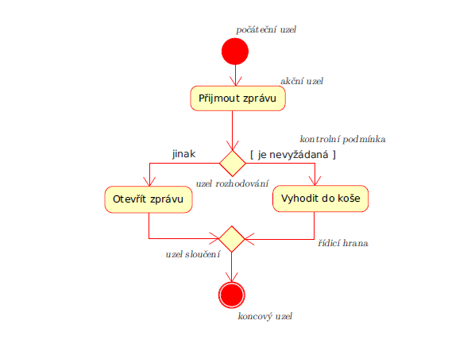
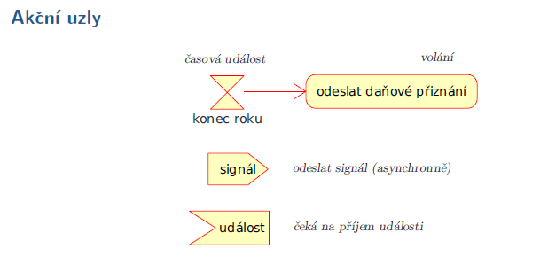
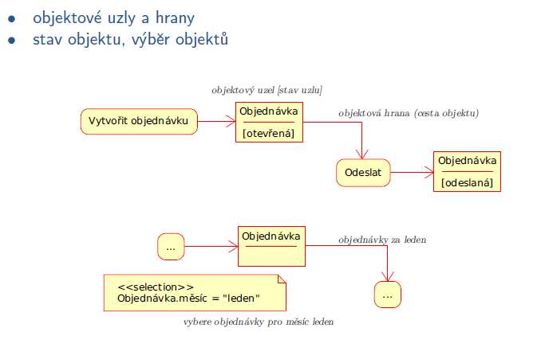

### **Stavový diagram**
- modelování životního cyklu jednoho reaktivního objektu
- mohou modelovat dynamické chování těchto objektů
    - třídy
    - případy užití
    - podsystémy
    - systémy
- reaktivní objekt - reaguje na vnější události, životní cyklus je modelován jako řada stavů, přechodů a událostí
    - chování je důsledkem předchozího chování (následný stav závis na aktuálním stavu)

**Co můžu napsat dovnitř stavu**
- entry - akce při vstupu
- exit - akce při výstupu
- event název(argumenty)(podmínka) - akce
- do - název interní aktivity

#### **Stavový diagram - příklad**
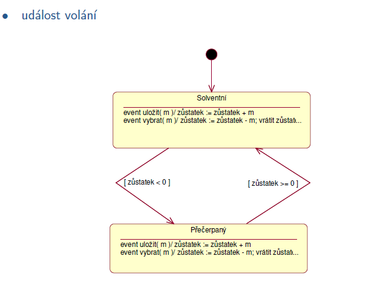

! Další příklady v sešitě.