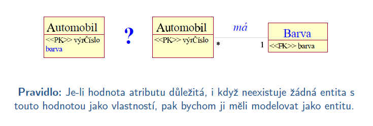
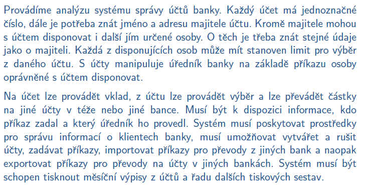

- 04.10.2021

# Strukturovaná analýza a návrh

### **Základní přístupy k analýze a návrhu**
- strukturovaný - systém je chápán jako kolekce funkcí (procesů), komunikujících na daty
    - funkce nejsou vázány na jedny určitá data, můžeme je teoreticky používat všude
- objektově orientovaný - systém se chápe jako kolekce vzájemně komunikujících objektů
    - oproti strukturovanému přístupu tam je rozdíl v tom, že data a metody které s těmito daty pracují jsou zapozdřeny do jednoho objektu a tím i více provázány

**Strukturovaný přístup**
- Konceptuální model
    - vyjadřuje podstatu systému, říká co má systém dělat
- Logický model
    - definuje, jak bude konceptuální struktura dat implementována
    - modely - lineární, síťový, relační...
- Fyzický model
    - model fyzického uspořádání dat (soubory)

Funkční (procesní) modelování
- základní model strukturované analýzy
- diagram datových toků - DFD (obdoba Use Case)

Datové modelování
- ukazuje entity aplikační domény zpracovávané systémeme a statické vztahy mezi nimi (typicky perzistentní data ukládaná v databázi)
- zásadní význam pro databáze
- ER diagram

*Základní konceptuální modely*
- datový slovník - obsahuje specifikace prvků modelů
- stavový diagram (State-Transition diagram - STD)
    - modeluje dynamické chování systému nebo jeho části
        - stavy - zachycují určitou situaci
        - přechody - změny stavů
        - podmínky - externí události ovlivňující proveditelnost přechodů
        - akce - události jako komunikace, výpočet
    - teoretický koncept - konečný automat
    - UML - stavový diagram

**Data flow diagram**
- technika použivaná při strukturované analýze a návrhu pro specifikaci chování systému
- hierarchický model
- ukazuje funkce systému, toky dat mezi systémem a okolím a toky dat mezi funkcemi a datovými skaly
- blíže k návrhu 

#### **Příklad pro DFD - systém správy účtů**

# Datové modelování
- cílem je:
    - mít v systému všechna potřebná data
    - nemít v systému žádná nepotřebná data
    - vyjádřit vztahy mezi daty
    - popsat trasformaci dat v systému

## Datové modelování - ER model

- slouží k modelování dat aplikační domény a jejich vztahů "v klidu"

### Základní pojmy

**Entita**
- "věc" reálného světa (objekt) rozlišitelný od jiných objektů
- např. klient banky s ID K999, účet číslo U001...

**Entitní množina**
- množina entit téhož tytu, které sdílí tytéž vlastnosti
- např. entitní množina Klient, Účet... (hodně zjednodušeně jako třídy a objekty v OOP)

**Atribut**
- vlastnost entity, která nás v kontextu daného problému zajímá
- např. Klient: čísloKlienta, jméno, příjmení, adresa...
- může být jednoduchý nebo složený (jméno se dá rozložit na křestní jméno a příjmení, adresa na ulice, město, PSČ,...)
- *Typy atributů*
    - jednohodnotové a vícehodnotové (telefon - může být více čísel...)
    - prázdné (NULL) - mohou nabývat hodnoty NULL (nemusí se zadávat)
    - odvozené atributy - od data narození odvodím věk

**Vztah**
- asociace mezi několika entitami
- např. klient s číslem K999 vlastní účet s číslem účtu U001...
- jméno vztahové množiny i jméno role vyjadřuje význam vztahu
- vztah může obsahovat atributy - ty se používají, když atribut nelze přiřadit ani jedné z entit

**Vztahová množina**
- množina vztahů téhož typu, které sdílí tytéž vlastnosti
- např. Klient vlastní Účet - pro vztah mezi entitami Klient a Účet
**Kardinalita**
- kardinalita je maximální počet vztahů daného typu (1 : 1; 1 : N; N: N, případně přesněji)
**Členství / účast**
- minimální počet vztahů daného typu (vztahové množiny)

### Pravidla návrhu ERD
- zobrazujeme pouze data a jejich vztahy, žádné procesy
- každý atribut zobrazujeme pouze jednou
- seskupujeme data jen pro účely databáze
- zobrazujeme pouze perzistentní datové objekty
- zobrazujeme pouze nezbytně nutné vztahy
    - *Ucitel* učí *Predmet*, který má zapsaný *Student*
    - *Ucitel* učí *Student* - redundantní, protože kterého studenta učí jaký učitel zjistíme už z předchozího vztahu

### Doporučení pro tvorbu ERD
- Jména
    - musí být srozumitelná a musí vyjadřovat význam entitních a vztahových množin
    - entitní množiny: podstatná jména
    - vztahové množiny: slovesa, předložky
- Mezi stejnými entitními množinami může být několik vztahových množin

- Identifikátor
    - entity a vztahy musí být identifikovatelné
    - hodnota ID je unikátní (v rámci vyvíjeného systému) a minimální
- Použít entitní množinu nebo atribut?

- Kardinalita a umístění atributů

**Slabé (weak) entitní množiny**
- silná entitní množina **má** ID tvořený vlastními atributy
- slabá entitní množina **nemá** ID tvořený vlastními atributy

### Rozšíření ER modelu
- zobecnění množin (generalizace množin)
- kategorie (typ UNION)
- dědičnost atributů a vztahů

**Zobecnění (generalizace)**
- entity mají stejný základ (atributy) lišící se v některých atributech
- např. *Spořící účet* a *Běžný účet* jsou speciální variantou *Účet*
- omezení generalizace
    - příslušnost - příslušnost entity do jedné nebo do více specializovaných entitních množin
    - úplnost - zda každá entita z vyšší úrovně musí nebo nemusí patřit do jedné z entitních množin na nižší úrovni

### Postup při návrhu ERD
**Základní kroky**
1. zvolte jednu entitu ze specifikace požadavků
2. určete atributy entity, označte kandidátní klíče
3. prověřte atributy, zda je potřeba zaznamenat informace o některém z nich v samostatné entitě
4. další entita -> krok 1
5. vytvořte vztahy mezi entitami
6. určete, zda některé atributy potřebujé být identifikovány pomocí více netit -> atribut přiřaďte vztahu, který spojuje příslušné entity
7. identifikujte a odstraňte redundantní vztahy

*Poznámka*
- entita se modeluje jako entitní množina
- vztah se modeluje jako vztahová množina

#### **Příklad ERD - systém správy účtů**

Řešení v sešitě