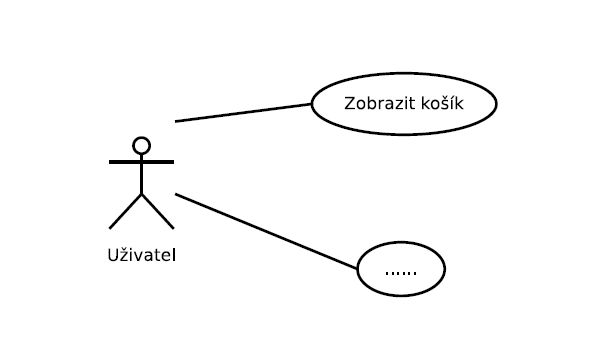
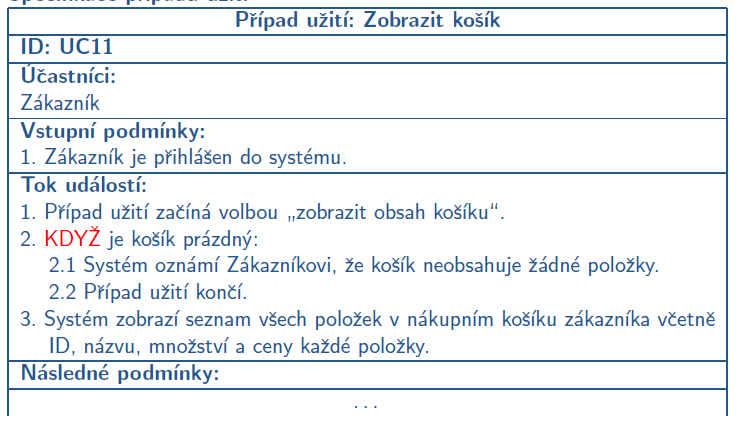
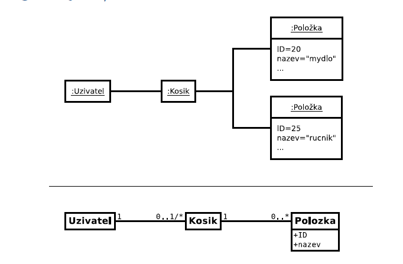
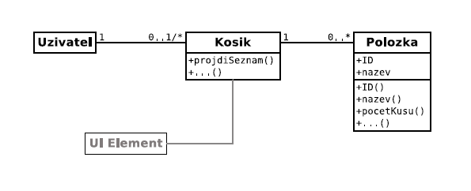
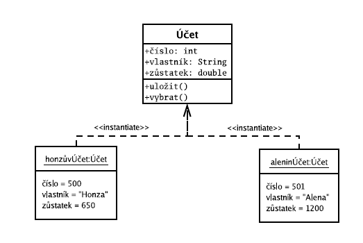
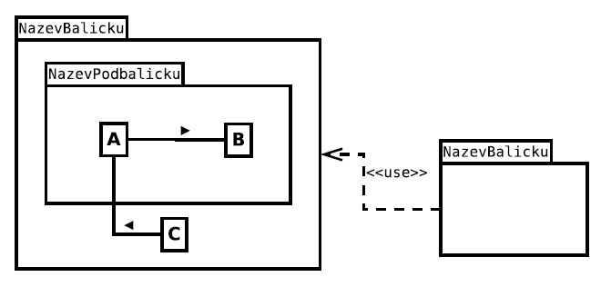

- 14.10.2021 (Křena)

# Objektově orientované modelování

#### **Příklad diagramu případů užití jakožto objektu**

#### **Specifikace případu užití**

- více viz. 2. přednáška
#### **Diagram objektů / tříd**

**Doménový model**
- zachycuje konceptuální elementy (prvky, objekty...) doménového systému
- cílem je najít a pojmenovat význačné prvky systému a vztahy mezi nimi
- doménový model != datový model

## Objektově orientovaný přístup
- kolekce vzájemně komunikujících objektů
- soubor objektově orientovaných prostředků (objekty, třídy, UML...) a metodik (RUP,...)
, vykazuje vyšší stabilitu navrhovaných prvků z pohledu měnících se požadavků

**Objekt**
- reprezentuje entitu reálného či abstraktního světa
- má jasně vymezenou roli (zodpovědnost)
- zná sám sebe (identita)
- uchovává data (stav)
- má metody (chování)
- umí zpracovávat a posílat zprávy (protokol)

*Rozhraní objektu*
- operace VS metoda
    - operace reprezentuje abstraktní pohled na chování objektu
    - metoda implementuje operaci
    - signatura operace = název, typ návratové hodnoty
- rozhraní objektu
    - množina operací, které určují chování objektu a jeho vztah k dalším objektům
    - pouze definuje co objekt umí, ale nedefinuje způsob, kterým to objekt dělá

*Třídy objektů*
- seskupení objektů do tříd podle podobnosti (typu)

### Vlastnosti objektové orientace !zkouška
**Abstrakce** 
- vytvářený systém objektů je abstrakcí řešeného problému (zjednodušený pohled na systém bez ztráty jeho významu)
- vypíchnout, to co je v tom systému důležité
- analýza problému -> klasifikace do abstraktních struktur -> objekty/třídy
- klasifikace je založena na rozpoznávání podobností v řešené problematice

**Zapouzdření**
- seskupení souvisejících idejí (data, funkcionalita) do jedné jednotky
- máme objekt a ten obsahuje data, má nějaké metody okolo...
- seskupení operací a atributů do jednoho typu objektu (třídy) - stav je dostupný či modifikovatelný pouze prostřednictvím rozhraní
    - nevidím co je přesně uvnitř objektu, pouze jeho rozhraní
- omezení externí viditelnosti informací nebo implementačních detailů
- toto už je docela znatelný rozdíl oproti strukturovanému přístupu

**Polymorfismus**
- znalost třídy (objektu), jak provést určitou operaci, která  může být společná pro více tříd (objektů)
- máme třeba vykreslovat čtverec, trojúhelník, kolečko... a všechny tyto tvary mají metodu vykresli() a tou zavolají již svou vnitřní metodu naimplementovanou uvnitř sebe -> programátor neřeší co vykresluje, prostě vykresluje - u strukturovaného přístupu nemůžeme mít 50x (např.) stejnou metodu, musela by být rozdílná pro všechny tvary (vykresli_obdelnik(), vykresli_ctverec()...)

**Dědičnost**
- definuje a vytváří třídy (objekty), na základě již existujících tříd (objektů)
- mezi třídami (objekty) vzniká hierarchický vztah podle dědičnosti
- máme třídu Student a z něj vyrobíme třídu Doktorand

# Objektově orientované modelování v UML

## Jazyk UML
- Unified Modelling Language
- inspiroval se existujícími analytickými jazyky a modely - výběr nejlepších myšlenek
- základní modelovací jazyk metodiky RUP (první návrhy vytvořeny společně)
- standard OMG UML 2.x (asi co se aktuálně používá, zkontrolovat na přednášce)
    - obsahuje popis diagramů a jejich použití, jazyk pro specifikaci omezení a podmínek...

### Stavební bloky jazyka UML
**Předměty (Things)**
- samostatné prvky modelu
- např. třída, případ užití, stav, poznámky...

**Vztahy(Relationships)**
- určují vzájemnou souvislost předmětů
- např. závislost, agregace, kompozice, zobecnění...

**Diagramy (Diagrams)**
- pohledy na modely UML, kolekce předmětů a vztahů
- analytické diagramy - co bude systém dělat
- návrhové diagramy - jak to bude systém dělat
- např. Use Case Diagram, diagram tříd...

**Ornanemty (Adornaments)**
- každý prvek modelu má svůj symbol (např. třída), který může být obohacen různými ornamenty
- obvykle není potřeba vždy zobrazovat všechny podrobnosti, některé ornamenty mohou být skryty (různé pohledy na systém)

### Diagramy jazyka UML 2.5
**Diagramy struktury**
- Diagram tříd
    - zobrazuje třídy a statické vztahy mezi nimi
    - vztahy mezi třídami:
        - Zobecnění (dědičnost) - odvozená třída sdílí atributy, chování, vztahy a omezení obecnější třídy, může si přidávat své další atributy
        - Asociace - slouží k zachycení vztahů mezi třídami (jejich instancemi); má roli, název, násobnosti...
            - vypadá podobně jako ER diagram, ale zoprazuje jak systém vypadá v nějakém určitém stavu, ne pořád
            - jsou to ty šipky s kosočtvercema vyplněný / nevyplněný, vysvětlení v sešitě
        - Závislost - vyjadřuje jiné různé vztahy mezi objekty či třídami; např metoda třídy A ke svému fungování potřebuje argument třídy B (závislost A na B)
            - např. <\<use>> nebo <\<instance>>
        - Realizace - vztah mezi třídou a rozhraním
- Diagram objektů
    - je úzce svázán s diagramem tříd
    - znázorňuje objekty a jejich relace v určitém čase

        

- Diagram seskupení
    - seskupení sémanticky souvisejících elementů
    - definuje hranice objektu
    - umožňuje souběžnou práci v etapě návrhu
    - balíčky mohou obsahovat:
        - případy užití
        - analytické třídy
        - realizace případů užití
        - další balíčky

        

- existují i další ale ty nás nezajímají

**Diagramy chování**
- Diagram případů užití (Use Case Diagram)
- Diagram aktivit (Activity Diagram)
- Stavový diagram (State Machine Diagram)
- ...

**Diagramy interakce**
- Sekvenční diagram (Sequence diagram)
- Diagram komunikace (Communication diagram)
- ...

### Principy objektově orientovaného návrhu

**Problémy spojené se špatným návrhem**
- hodí se to řešit, protože pokud máme špatný návrh tak se špatně mění software a vyžaduje to úpravy na mnoha místech
- změna způsobí problémy v jiných, zdánlivě nesouvisejících částech SW
- vyčlenit část SW pro znovuoužití je náročnější než tu část napsat znovu
- toto jsou indikátory, jak poznat jestli je návrh dobrý nebo špatný (v těchto případech špatný xd)

**Single responsibility principle**
- třídy by měly mít jen jednu zodpovědnost - jediný důvod ke změně
    - zodpovědnost je závazek nebo povinnost k prvku něco dělat nebo něco vědět
    - zodpovědnost != metoda

**Open closed principle**
- třída by měla být otevřená pro rozšíření ale uzavřená pro modifikace (měla by být rozšiřitelná bez nutnosti úpravy kódu)

**Dependency inversion principle**
- závislost na abstaktním ne konkrétním
- závislosti by měly směřovat jedním směrem, a to od konkrétního k abstraktnímu
- důsledky:
    - redukce závislosti na kódu
    - abstraktní rozhraní se mění mnohem méně než konkrétní implementace

**Principy návrhu balíčků (komponent)**
- release reuse equivalency principle - prostě vypouště spolu jen věci co spolu souvisí (např. matematické funkce ANO; matematické funkce nějak smíchané s nákupním košíkem NE)
- common closure principle - třídy, které se mění společně patří k sobě
- common reuse principle - třídy, které nejsou znovuoužívány společně by neměly patřit k sobě

! nelze dodržet všechny principy najednou

**Acyclic Dependecies Principle**
- závislosti mezi balíky nesmí tvořit cykly
- minimální počet závislostí mezi balíky -> jednodušší údržba a uvolňování nových verzí (menší počet závislých balíků pro testování)

**Rozhraní VS implementace**
- signatura
    - deklaruje formální podobu operace
    - lze zkontrolovat překladačem
- kontrakt
    - deklaruje sémantiku operace a její podmínky
    - nelze zkontrolovat překladačem
- implementace
    - realizuje operace definované signaturami a kontrakty
    - implementace by se měla skrývat

**Liskov substitution principle**
- odvozené třídy by měly být zaměnitelné za bázové třídy
- např. kružnice je speciální elipsa (kružnice se dá definovat jako elipsa)

**Do not Repeat Yourself**
- neopakujte stejný kód na různých místech
- problémy s modifikací a udržovatelností
- opakující se kód může být trasformován do samostatné metody