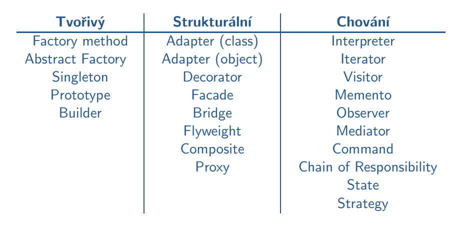

- 18.10.2021

# Jazyk UML - pokračování

## Diagramy interakce
**Diagramy interakce**
- popisují spolupráci objektů

**Čára života**
- zastupuje jednoho účastníka interakce (objekt)
- označení: *nazev[selektor]:typ*
    - nazev - identifikátor čáry života
    - selektor - podmínka pro výběr určité instance
    - typ - klasifikátor, jehož čára života je instancí

**Zprávy**
- komunikace mezi účastníky interakce
- typy zpráv:

    

**Základní typy diagamů interakce**
- sekvenční diagram
    - zdůrazňuje časovou posloupnost předávání zpráv
    - přehlednější a srozumitelnější než diagramy komunikace
    - každý objekt (čára života) je zobrazen s časovou osou
- diagram komunikace
    - zdůrazňují strukturální vztahy mezi objekty

*Sekvenční diagram*
- příklad, ze kterého se vychází

    

1. vytvoříme diagram tříd

    

2. vytvoříme postup, jak se budou přednášky přidávat

    

- další příklad, teď na rozšíření (v tomto diagramu jdou zobrazovat omezení, stavy...)

*Diagram komunikace*
- objekty jsou spojeny linkami (komunikační kanály)
- zprávy jsou řazeny podle hierarchického číslování
- (vycházíme ze stejného příkladu a diagramu tříd jako předtím)
- zprávy píšu jednoduše nad vztah?, např. 1: pridatPrednasku("UML")

    

- další příklady viz. prezentace (taky musím dávat pozor jak se to dělá xd)

## UML v etapách vývoje SW
**Tvorba analytických modelů**
- zaměřuje se na otázku *co*, neodpovícá detailně na otázku *jak* (to je úkolem návrhu)
- zobrazuje důležité věci (objekty, vztahy...) z problémové domény
    - třídy Zákazník, Košík...
    - třída pro přístup k databázím patří do řešení (návrhu)
- analytické třídy
- diagramy případů užití
- specifikace případů užití
    - diagramy aktivit
    - stavové diagramy
- realizace případů užití
    - modelují interakce analytických tříd
    - identifikují zasílané zprávy mezi objekty (instancemi tříd)

**Tvorba návrhových systémů**
- vychází z výstupů etapy analýzy
- zaměřuje se na otázku *jak*, věnuje se detailům
- specifikace modelů je na takové úrovni, že je lze přímo implementovat
- upřesňování analytických diagramů
    - návrhové třídy
    - realizace případů užití
    - ...
- patří sem i doména řešení - výběr jazyka, databáze, v jakém prostředí to má fungovat (OS)...

**Návrhové třídy**
- specifikace těchto tříd je na takové úrovni, že je lze přímo implementovat

    

- musím už specifikovat všechno (datové typy, knihovny co budu používat, vrstva aplikačního serveru...)

- příklad upřesnění modelu v etapě návrhu (příklad bod 2 sekvenční diagram)

    

**Upřesnění analytických relací**

Asociace
- agregace vs kompozice
    - upřesnění vztahu celek/část
- asociace povýšená na třídu
    - návrh asociačních tříd
- asociace typu 1:N
    - realizace (nejčastěji kolekce)
    - prostě vyrobit vazební tabulky

**Rošiřitelnost UML**
- omezení
    - definují omezující podmínky
    - rozšiřují sémantiku elementu (např. OCL)
- stereotypy
    - definuje nový element na základě stávajícího elementu
- označené hodnoty

**Omezení a dotazy nad modely v UML**
- modelovací techniky v UML nedokážou zachytit všechny závislosti graficky a formálně
- řeší se poznámkou se slovním popisem -> nemusí být jednoznačné, protože slovní popis je nedostatečný

    

    - toto komplikuje automatické konverze
- **jednoznačný jazyk -> OCL**

### Object Constraint Language (OCL)
- není to programovací jazyk
- je součástí OMG standardů pro UML
- definuje podmínky, omezení a dotazy nad UML modely
- navržený pro návrháře (nevyžaduje silný matematický základ)

**Využití OCL**
- specifikace podmínek pro vykonání metod, nebo co musí platit po provedení té metody
- specifikace invariantů (podmínka, která se nemění) tříd
- specifikace počátečních hodnot atributů
- specifikace těla operace
- ...

**Typy omezení**
- invariant - podmínka, která musí být splněna všemi instancemi
- precondition - podmínka, která musí platit před provedením operace
- postcondition - podmínka, která musí platit těsně po provedení operace
- guard - omezení, které musí být pravdivé těsně před přechodem mezi operacemi
- příklad UML s prvky OCL (příklad s ověřováním věku)

    

- přepsáno do textové podoby

    

    

## Znovupoužitelnost
**OO návrh a programování**
- znovupoužitelnost zajistí obecný návrh, ale aplikovatelnost na řešený problém nám zajistí specifický návrh -> spor
- přesto je možné použít řešení, které již fungovalo -> takováto řešení jsou výsledkem mnoha pokusů a použivání
    - z toho vznikly vzory pro řešení stejných typů problémů

**Návrhové vzory**
- základní sada pro řešení podobných problémů
- usnadňují znovupoužitelnost
- umožňují efektivní návrh
- návrhový vzor je pouze šablona, ne implementace řešení!
- umožňuje to použít stejný postup řešení, ale ty řešení jsou rozdílná

*Prvky návrhového vzoru*
- název
- problém
- řešení
- důsledky

*Základní rozdělení vzorů*
- tvořivý - zabývá se procesem tvorby objektů
- strukturální - zabývá se skladbou tříd či objektů
- chování - zabývá se způsoby vzájemné interakce mezi objekty

    

*Jedináček (Singleton)*
- účel - třída může mít pouze jednu instanci
- motivace - nutnost mít pouze jednu instanci (např. tiskové fronty)
- důsledky - řízený přístup k jediné instanci
- příklad:

    

*Abstraktní továrna (Abstract factory)*
- účel - vytváření příbuzných nebo závislých objektů bez specifikace konkrétní třídy
- motivace - např. změna vzhledu sady grafických nástrojů
- důsledky - izoluje konkrétní třídy - klient pracuje pouze s rozhraním
    - usnadňuje výměnu produktových řad
- struktura:

    

- !příklad na Abstract factory v prezentaci!

*Command*
- účel - zapouzdření požadavků nebo operací, vzor chování
- motivace - zaslání požadavku na obecné úrovni, aniž známe konkrétní protokol, podpora undo operaci
- důsledky - reprezentuje jeden provedený příkaz, umožňuje uchovávat stav klienta před provedením příkazu
- !příklad v prezentaci!