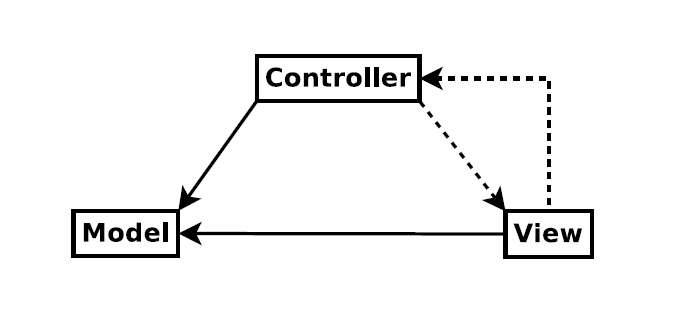
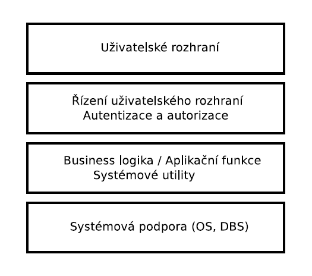
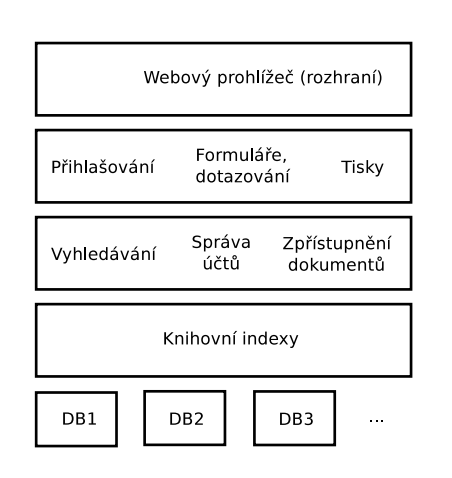
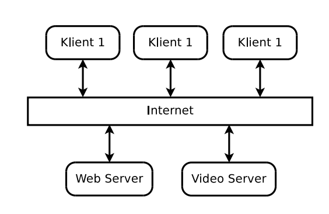

- 01.11.2021

# Architektonické vzory

## Návrh architektury

**Návrh architektury**
- zaměřuje se na to, jak má být systém organizován
- vytváří se na počátku vývoje
- spojuje návrh se specifikací požadavků
- identifikuje komponenty, jejich vztahy a komunikaci (kdo je za co odpovědný)

**Vztah mezi specifikací a architekturou**
- dekompozice - jedna z důležitých aktivit při analýze a specifikaci požadavků
- dekompozice je důležitá pro organizaci specifikace a rozdělení práce na specifikaci požadavků
- dekompozice do komponent či podsystémů je základem abstraktního návrhu architektury

**Architektonické vzory**
- abstraktní popis dobře vyzkoušených praktik
- ověřeno na různých systémech a prostředích
- každy vzor by měl obsahovat k čemu je vhodný použít, slabé a silné stránky

### **Model-View-Controller** (Kočí to rád zkouší)

- odděluje prezentaci a interakci od systémových dat
- používá se, když neznám budoucí požadavky na systém
- Výhody - data mohou být měněna nezávisle na jejich reprezentaci, nezávisle na tom jak se na ně někdo dívá
- Controller zajišťuje že se data změní, informuje View o změnách
- Nevýhody - nehodí se pro menší projekty, ze začátku je trochu těžší pro něj přizpůsobit architekturu
- Konceptuální model
    - Model - zapouzdřuje data a stav aplikace, informuje View o změnách stavu, reprezentuje, co má ta aplikace dělat
    - View - zobrazuje model, reprezentuje pohled na Model
    - Controller - zajišťuje změny modelu na základě User akcí, prakticky řídí, jak ty změny budou probíhat
- Konkrétní pohled - webové aplikace (příklad)
    - Model - databáze, business logika
    - View - dynamické stránky, formuláře
    - Controller - zpracování HTTP protokolu, validace dat
- MVC odděluje model a pohled na model
- můžeme u toho využí Observer, víc v přednášce

### **Vrstvená architektura**

- organizuje systém do vrstev, každá vrstva má přidělenou svou zodpovědnost (funkcionalitu), zároveň každá vrstva odděluje elementy systému a lze je modifikovat nezávisle (můžu ty vrstvy i nahrazovat nezávisle na sobě, musíme pouze dodržet rzohraní mezi vrstvami)
- vrstva poskytuje služby nadřazené vrstvě, nejnižší vrstva reprezentuje jádro
- používá se pro přidávání nových vlastností nad existujícím systémem, vývoj je rozdělen do několika týmů, každý se věnuje jedné vrstvě
- požadavek na víceúrovňovou bezpečnost

**Příklad knihovního systému řídícímu přístup k chráněným elektronickým zdrojům**
- pětivrstvá architektura, poslední architektura představuje jednotlivé databáze
- Výhody
    - nahrazení celé vrstvy za novou
    - redundantní služby (autentizace atd.) na každé vrstvě pro zvýšení bezpečnosti
- Nevýhody
    - čisté oddělení vrstev je v prai náročné
    - vrstva vyšší úrovně může potřebovat komunikovat s nižšími vrstvami přímo, ne jen protřednictvím bezprostředně navazující vrstvy
    - vícenásobná interpretace požadavku může negativně ovlivňovat výkon aplikace

### **Architektura Klient-server**
- funkcionalita je rozdělena do služeb, každou službu poskytuje nezávislý server
- klient je uživatel služeb, přistupuje na servery

- používá se, když potřebujeme mít data v databázi přístupná pro velký počet lokací
- servery mohou být replikovány - lze využít, pokud je zatížení systému proměnlivé
- výhody - servery mohou být distribuovány na síti, služby josu dostupné všem klientům
- nevýhody - služby je jen jeden bodd v síti -> náchylný k útokům, výkon aplikace závisí na vytížení sítě (nedá se přesně předpovědět), problémy se správou, pokud server nevlastníme

# Komplexní modelování v procesu vývoje

**Pojmy**
- problémová doména - reprezentuje reálný systém, vychází odsud obchodní požadavky. user požadavky, funkční a nefunkční požadavky
- doména řešení - reprezentuje vyvíjený systém, modely systému, návrh, způsob řešení

### Konceptuální modely
- doménový model
    - zachycuje entity a pojmy problémové domény
    - diagram analytických tříd
- model architektury
    - zachycuje dekompozici systému a jeho budoucí architekturu
    - diagram tříd / tříd
- modely chování
    - zachycuje uživatelské a funkční požadavky
    - diagram případů užití, aktivit a stavový diagram
- modely interakce
    - zachycují interakci modelovaných elementů, např. objektů a aktérů participujících na případu užtití
    - sekvenční diagram, diagram komunikace
- modely struktury
    - zychycují strukturální vazby mezi elementy systému
    - reflektují principy návrhu architektury
    - diagram návrhových tříd
- datový model
    - zachycuje perzistentní data v systému
    - ER diagram

### Doménový model
- model konceptuálních (analytických) tříd
    - nalezení abstrakcí v problémové doméně (slovníček pojmů)
- měl by zobrazovat pouze věci podstatné z hlediska problémové domény
    - třídy Zákazník, Košík...
- doménový model NENÍ datový model - konceptuální třída nemusí mít atributy ani nemusí reprezentovat perzistentní data
- zmenšuje propast mezi SW reprezentací a naším mentálním modelem systému

**Konceptuální třídy**
- obsahuje minimum vazeb na jiné analytické třídy
- obsahuje jen nejpodstatnější atributy a operace
- obsahuje malou a správně definovanou množinu odpovědností
- Hledání konceptuálních tříd
    - analýza podstatných jmen -> třídy, atributy
    - analýza sloves -> odpovědnosti tříd
    - využití existujících modelů
- každá třída spolupracuje s jinými třídami
- má 3 až 5 odpovědností
- pozor na hlubokou hierarchii při dědičnosti

### Modely interakce
- modelují interakce konceptuálních tříd
    - možnost nalezení nových konceptuálních tříd
- identifikují zasílané zprávy mezi objekty (instancemi tříd)

### Modely struktury
- modely návrhových tříd
- vychází z doménového modelu, modelu chování a interakce
- seskupení tříd reflektuje zvolenou architekturu

! v prezentaci je demonstrační příklad