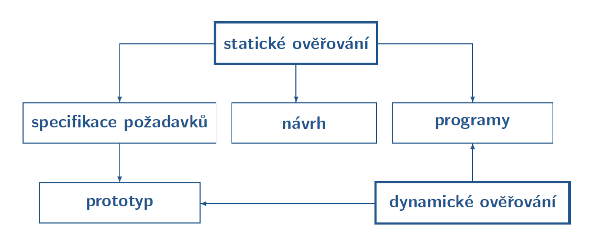
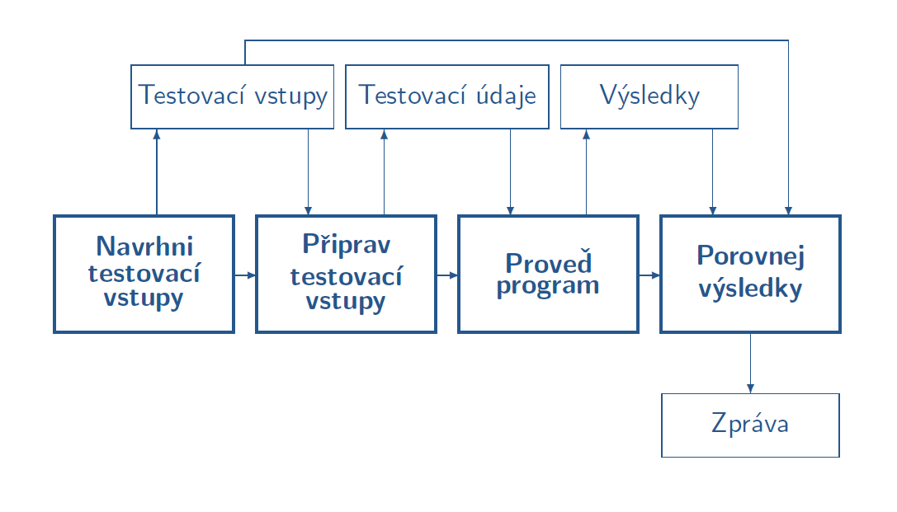

- 08.11.2021

# Implementace SW

- proces transformace návrhu jednotlivých modulů a jejich vzájemných vazeb do programové realizace
- výsledkem je spustitelný SW (SW produkt)

Podíl implementace na celkovém objemu prací v životním cyklu SW se snižuje:
- zavedením vysokoúrovňových PRG jazyků
- využíváním integrovaných IDE
- generováním aplikací z modelů (přímo z navrženýho UML, ještě to není dokonalý, vyhodí to jen kostru)
- znovupoužitelností (využití Internetu)

## Vlastnosti SW produktu
- musíme dělat určité kompromisy např. použitelnost x bezpečnost, efektivnost x udržovatelnost

### Použití (taky bývá u zkoušky, třeba definujte max. 30 slovy co je to správnost apod.)
- správnost - míra, do jaké SW odpovídá specifikaci
- použitelnost - úsilí, které je nutné vynaložit na to, aby se dal SW používat
- efektivnost aplikace - doba odezvy, požadavky na paměť
- efektivnost procesu tvorby programu - čas potřebný na vývoj
- bezpečnost - míra odolnosti vůči neoprávněným zásahům do systému (úmyslný útok)
- spolehlivost - pravděpodobnost, že bude SW v daném čase vykonávat zamýšlenou fci (nehoda)

### Přenos
- přenositelnost - z jedné platformy na jinou
- interoperabilita - zajištění spolupráce systému s jinými systémy
- znovupoužitelnost - jak dobře se dají jednotlivé části SW použit v jiných projektech

### Změny
- udržovatelnost - úsilí, které je potřeba vynaložit na další vývoj a údržbu SW, zahrnuje to i čitelnost a pochopitelnost zdrojového kódu
- testovatelnost - úsilí nutné pro testování SW
- dokumentovanost - míra, do které jsou všechna rozhodnutí při vývoji zdokumentována

Určíme si priority ze změn i přenositelností podle toho, co potřebujeme

## Výběr programovacího jazyka

Kritéria výběru PRG jazyka
- zkušenosti programátorů s jazykem
- vhodnost jazyka pro konkrétní úkol
- rozšřenost jazyka
- požadavky zákazníka
- cena vývojového prostředí
- ...

**Důležité vlastnosti**
Malé projekty
- syntax, vlastnosti jazyka, datové struktury...
Velké projekty
- podpora abstrakce, plánovací mechanismy, prostředí

### Generace programovacích jazyků
1. generace
    - programování přímo v binárním kódu
2. generace
    - assemblery, symbolické vyjádření binárních instrukcí
3. generace
    - strukturované programování
    - strojově nezávislé jazyky
    - C, Pascal, Fortan...
4. generace (actually 3,5 generace)
    - OOP jazyky
    - Python, Java...
5. generace
    - neprocedurální jazyky, vizuální jazyky
    - snaha o zjednodušení programování, využívají se vestavěné fce a komponenty
    - SQL, MATLAB
    - "End-User Programming" - MS Excel...
6. generace
    - neprocedurální jazyky
    - definují se objekty, pravidla, omezení, kritéria pro řešení, postup řešení pak hledá stroj
    - AI, neuronové sítě...

**Typy, kontroly typů**

Význam typování
- určuje sémantický rozsah elementů
- víme jaké operace můžeme provádět, můžeme prvádět kontrolu datových typů..

**Staticky VS dynamicky typované jazyky**
- staticky typované jazyky mají pevně dané typy, které se nedají měnit, k typové kontrole dochází během kompilace (C, C++, Java)
- dynamicky typované jazyky - k typové kontrole dochází až za běhu programu (Python, Self...)

## Strategie implementace
- postup, jakým se realizují jednotlivé SW části a odevzdávají do testování
- částečná závislost na architektuře a strategii návrhu

### Implementace zdola-nahoru
- systém je možné předvádět až po jeho úplném dokončení
- možnost přímého použití odladěných modulů nižších úrovní
- chyby v logice se projevují až později

### Implementace shora-dolů
- možnost demonstrace systému poměrně brzy
- včasná identifikace nejzávažnějších chyb
- testování logiky systému je náročnější než testování jednotlivých částí

*V praxi se používá kombinace těchto dvou*

## Dobré programátorské praktiky
- komentáře
- jednoduchost
- přenositelnost - žádné magické konstanty (cesty, soubory, adresy...)
- jednotný programátorský styl - odsazení, pojmenovávání proměnných, způsob ošetření chyb...
- v týmu potom používání verzovacích nástrojů (Git)
- dokumentace
    - interní dokumentace - týká se zdrojového kódu, slouží k vývoji
    - externí dokumentace - pro uživatele basically
    - měla by obsahovat název, autory, datum, účel...

# Validace a verifikace programu
- zjišťujeme, zda SW odpovídá specifikaci a splňuje potřeby uživatele
- sledujeme: správnost, spolehlivost, efektivnost, bezpečnost...

## Cíle verifikace a validace
- odhalit chyby během vývoje
- prokázat požadované vlastnosti

## Typy ověřování
- statické - nevyžaduje běh programu, lze v libovolné etapě vývoje SW
- dynamické - proces odvození vlastností výrobku na základě výsledků použití (běhu) programu s vybranými vstupy

### Statické ověřování
- prakticky prohlížení a projíždění kódu před jeho spuštěním
- různé přístupy
    - formální (Inspection)
    - neformální (Walkthrough)
    - koukání přes rameno (Over-The-Shoulder)
    - párové programování (Pair Programming)
    - koupací kačenka (Rubber duck Debugging)

**Code review**
- nejefektivnější způsob odhalování chyb v kódu
- zvyšuje čitelnost a udržovatelnost kódu
- zlepšuje schopnosti méně zkušených programátorů
- ale nemusí to být moc příjemné

### Dynamické ověřování

#### **Testování**
- velikost množiny testovacích vstupů musí být přijatelná
- množina těchto vstupů se určuje na základš testovacího kritéria
- testovací kritérium určuje podmínky, které musí splňovat množina testovacích vstupů, např. pokrytí všech příkazů v programu

**Techniky testování**
- náhodné testování
- funkcionální testování
    - zjišťuje, zda vstupně-výstupní chování odpovídá specifikaci
    - neuvažuje se vnitřní struktura, logika modulu
- strukturální testování
    - vychází z vnitřní struktury programu, testuje se implementace programu
    - založeno na tocích řízení a tocích dat
- testování rozhraní

**Strategie testování**
- testování zdola-nahoru
    - testují se komponenty na nižší úrovni, poté se integrují do vyšší komponenty a znovu testují
    - hodí se pokud je většina komponentů stejné úrovně připravena
- testování shora-dolů
    - testují se integrované moduly nejvyšší úrovně, poté se testují submoduly
- sendvičové testování
    - kombinace předchozích dvou
- jednofázové testování
    - moduly se testují samostatně a pak se naráz integrují
    - náročná identifikace chyby při integraci
- testování porovnáváním
    - testuje se více verzí systému na testování

**Strukturální testování**
- vychází z vnitřní struktury programu, testuje se jeho implementace
- snaha o pokrytí různých struktur programu - řízení, data
- mutační testování - podle tohoto testuju testy: úmyslně zavedy chyby do kódu a zjišťuju, jestli na tyto chyby přijdou testy

**Testování produktu**
- účely testování:
    - testování funkčnosti celého systému
    - testování robustnosti celého systému
    - kritické testování
    - ...
- způsob testování - automatické x ruční
- testovací scénář - postup pro testovnání vlastnosti komponenty
- zpráva o chybách - shrnuje jaké testy byly provedeny, s jakými daty a jakým výsledkem
    - je potřeba tu chybu správně specifikovat (ne něco jako "Nějak to špatně počítá...")

**Statické testování**
- analýza programu bez spuštění
- snaží se najít časté programátorské chyby, např:
    - syntax error
    - nedosažitené části programu
    - neinicializované proměnné
    - nevyužití hodnoty po jejím přiřazení do proměnné
    - použití paměti po jejím uvolnění
    - dělení nulou
    - opakované uzavření souboru
    - ...
- obvykle hlásí spoustu falešných chyb

**Akceptační testování**
- testování na reálných datech
- testuje se u uživatele
- uživatel určuje, za produkt splňuje zadání
- další změny po akceptaci již představují údržbu systému
- vztahuje se na zakázkový SW

**Alfa a Beta testování**
- pro generické SW výrobky, kde není možné provést akceptační testy u každého zákazníka (operační systémy, kompilátory...)
- Alfa testování
    - tam, kde se vyvíjí SW
    - testuje uživatel, vývojáři sledují chyby
    - známé prostředí
- Beta testování
    - testují uživatelé u sebe
    - neznámé prostředí
    - výsledkem je zpráva uživatele -> modifikace SW -> předání SW