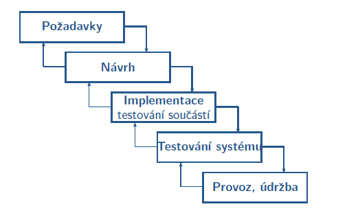

- 15.11.2021

# Modely životního cyklu

## Lineární modely životního cyklu

### Lineární (sekvenční) modely
- životní cyklus jde postupně od první etapy až do poslední
- typický představitel je vodopádový model

**V model**
- vychází z vodopádového modelu (má stejné základní vlastnosti, zachovává si jeho jednoduchost)
- písmeno V symbolizuje grafické uspořádání etap, zdůrazňuje vazby mezi návrhovou a testovací částí
- levá část - vývojové aktivity, plánování testů
- pravá část - testovací aktivity, provádění testů

**W-model**
- vychází z V modelu
- aktivity spojené s ověřováním a testováním jsou na stejné úrovni jako návrhové aktivity -> druhé souběžné V
- levá strana
    - V1 - analýza, specifikace, návrh,...
    - V2 - ověřování výstupů etap a plánování a návrh testů
- pravá strana
    - V1 - provádění testů
    - V2 - ladění, změny kódu, regresní testování

Všechny lineární modely trpí tím, že když se změní požadavky tak je velmi pracné předělávat systém tak, aby těmto požadavkům odpovídal
- příklad: Po dostavbě domu se změní požadavky a zákazník chce i sklep (problémek docela)
- proto se hodí spíš pro projekty kde máme pevně zadané požadavky už od začátku a máme jistotu že se nebudou měnit

### Iterativní modely životního cyklu
- sekvence etap se v životním cyklu opakuje
- vždy když vytvoříme část systému tak to ukážeme zákazníkovi -> méně pracné předělat pouze část než celý systém
- Vlastnosti
    - systém se vyvíjí v iteracích
    - v každé iteraci se vytvoří reálný výsledek
    - zákazník se účastní vývoje (nutnost!)
- je náročnější na řízení a má potenciálně větší šanci na horší strukturu, ale zákazník má možnost validovat výsledek se svými požadavky, protože v každé iteraci se vytvoří reálný výsledek

**Inkrementální model**
- na základě specifikace celého systému se stanoví ucelené části systému
- možnosti
    - pro každou část systému se zavede série vodopádů, je možné předávat uživateli po částech
    - počáteční analýza, specifikace a návrh jsou provedeny vodopádem, následuje iterativní přístup kombinovaný s prototypováním
- zjednodušení zavedení změn během vývoje, omezení projektových rizik
- vývoj po částech mže vést ke ztrátě vnímání logiky a technických požadavků systému
- zvýšená pozornost musí být věnována rozhraním modulů (částí)

**Spirálový model**
- vývoj je rozdělen na cykly, v každém cyklu se řeší ucelená část vývoje

- Význam cyklů (jejich počet není přesně stanoven)
    - první - globální rizika, základní koncept vývoje, volba metod a nástrojů
    - druhý - vytváření a ověřování specifikace požadavků
    - třetí - vytvoření a ověření návrhu
    - čtvrtý - implementace, testování, integrace
- Význam kvadrantů
    - Q1 - cíle cyklu
    - Q2 - vyhodnocení
    - Q3 - realizace
    - Q4 - plánování následujícího cyklu

*Analýza rizik*
- zjistit možná ohrožení průběhu projektu
- připravit reakce na tato rizika
- rizika se identifikují v každé fázi vývoje
- příklady rizik:
    - projektová - odchod lidí, snížení rozpočtu
    - technická - neznámé technologie, selhání HW
    - obchodní - špatný odhad zájmu o výsledek, ...

Spirálový model zavedl tzv. mezníky (milestones)

Výhody
- komplexní model vhodný pro složité projekty
- chyby a nevyhovující postupy jsou odhaleny dříve
- nezávislost na metodice či strategii návrhu/implementace/testování

Nevýhody
- závislý na analýze rizik
- vyžaduje precizní kontroly výstupů, zkušené členy týmu
- SW je k dipozici až po posledním cyklu (lze vyřešit použitím většího počtu implementačních cyklů)
- problematické je přesné plánování termínů a cen

# Metodiky vývoje SW

### Metodika Rational Unified Process - RUP
- výsledek výzkumu zkušeností řady velkých firem koordinovaný firmou Rational Software
- jedná se o objektově orientovanou metodiku
- návrh SW systému je vizualizován (UML,...)
- iterativní vývoj - verze systému, po každé iteraci spustitelný kód
- definuje obsah každé iterace
- definuje pracovní rámec (framework)
- dá se chápat a tedy i pojmout jako klasický heavyweight proces, ale i jako agilní proces
- Základní elementy:
    - pracovníci a role (kdo)
    - činnosti (jak)
    - meziprodukty (co)
    - pracovní procesy (kdy)
- Základní cyklus:
    - je rozdělen na 4 fáze
    - zahájení (inception) - 10%; rozsah projektu, náklady, základní rizika...
    - projektování (elaboration) - 30%; plánování, specifikace požadavků, architektura...
    - realizace (construction) - 50%; kompletace analýzy a návrhu, implementace, hodnocení výstupů...
    - předání (transition) - 10%; dodání, školení, podpora při zavádění
    - každá tato fáze je rozdělena na iterace (délka jedné iterace je cca 2 až 6 týdnů)
- Výhody:
    - robustní, použitelný pro celou škálu projektů
    - iterativní přístup, včasné odhalení rizik, správa změn...
    - vazba na UML
- Nevýhody:
    - detailní propracovanost - nevhodný pro menší projekty
    - komerční produkt (obsahuje hodně podpůrných nástrojů)

    

### Metodika Rapid Application Development - RAD
- rychlý iterativní vývoj prototypů
- funkční verze jsou dostupné dříve než u předchozích přístupů
- intenzivní zapojení zákazníka do vývoje
- prioritou je splnění business potřeb zákazníka, technologické a inženýrské kvality mají menší důležitost
- vhodný pro menší až středně velké projekty
- Fáze:
    - plánování - rozsah projektu, omezení...
    - návrh - modelování, prototypování...
    - provedení - pokračování návrhu, kódování, integrace, testování...
    - uzavření a nasazení - příprava dat, finální testování, přechod zákazníka na nový systém...
- Výhody:
    - flexibilita, schopnost rychlé změny návrhu podle zákazníka
- Nevýhody:
    - nižší kvalita návrhu, problém s udržovatelností
    - flexibilita vede k menší míře kontroly nad změnami

### Další přístupy k procesu vývoje SW
- Unified SW Development Process (zjednodušeně UP) - podobný jako RUP, ale není komerční
- Modifikované verze vodopádu
- Agilní přístupy (metodiky) (people-oriented) - kompromis mezi heavyweight (process-oriented) metodikami a projekty s žádnou metodikou

## Predikovatelnost procesu vývoje

### Prediktivní přístupy
- plánují velké části SW procesů velmi detailně pro dlouhý časový úsek
- problém většiny projektů je že se často mění
- dobře se predikují např. projekty NASA (doletět na Mars - nemění se konstanty)
- špatně se predikují projekty, které se v čase mění
    - většina business modelů
    - řeší se přes adaptivní modely

### Adaptivní přístupy
- pánují s přiměřenou mírou detailu
- plány se v průběhu revidují
- řídí se iterativním přístupem

## Process-oriented přístupy
- předpokládá že lidé jsou zdroje, které jsou dostupné v několika rolích: analytik, vývojář, tester...
- procesy by měly fungovat za všech okolností
- soustředí se na proces, člověk je jednoduše nahraditelný

## People-oriented přístupy
- orientuje se na lidský faktor
- lidé nepracují konzistentně v průběhu času
- pokud by člověk dostal každý den stejný úkol, vytvoří podobné, nikoli stejné výsledky
- lidé jsou komunikující bytosti - otázky a odpovědi v reálném čase
- Důsledky:
    - podstatná je individualita, rozvoj členů týmu
    - role člena týmu se může měnit
    - osobní komunikace - papírová dokumentace se vytváří především k dokumentačním účelům (pro návrh, revizi, údržbu...)
- předpokládá se že člověk je kompetentní profesionál, který je schopen řídit svou práci (není tam nějaká vyšší moc co by určovala každý krok)

- Základní teze
    - minimum formálních a byrokratických artefaktů
    - člen týmu je schopen rozhodovat technické otázky své práce
    - zákazník je také člen týmu
    - důraz na testování - kvůli neustálým změnám v návrhu i kódu

## Agilní metodiky
- důraz je kladen na průběžné a automtizované testování
- prakticky people-oriented přístup
- obsahuje samozřejmě i procesy, ale je na ně kladen menší důraz než na to, aby byli lidé schopni si tyto procesy přizpůsobovat

### **Extreme programming (XP)**

**Charakteristické vlastnosti**

Komunikace - programátoři, manažeři i zákazník spolu musí komunikovat
- XP využívá takové techniky, které komunikaci vyžaadují (testování, párové programování...)

Zpětná vazba
- snaha mít co nejdříve implementované nejdůležitější části systému, nejlépe nasazené přímo v provozu
- kvalita a hotovost odvedené práce se nejlépe zjistí testováním a zpětnou vazbou od zákazníka

Jednoduchost
- udržuje se přehled o tom co bude, ale je zároveň potřeba se soustředit i na to co je právě teď

Odvaha
- nebát se zahodit už naprogramovaný kód
- nebát se zahodit už skoro hotovou věc, když víme jak ji udělat lépe (pokud je čas samozřejmě xd)

Přírůstkové (malé) změny
- návrh a implementace se mění v čase jen pozvolna

Testování
- ke každé fci se píšou testy, někdy i předtím než se začne práce na samotné funkci
- zautomatizované testování

Pair programming
- programují dva, jeden píše a druhý se soustředí na problém ze širšího hlediska

Refaktorizace
- úprava stávajícího programu - zjednodušení, zefektivnění návrhu
- odstranění nepotřebných částí

Metriky
- přiměřený počet metrik, např. poměr plánovaného času a skutečného času

Motivace vývojářů
- lidé lépe pracují, když je práce baví
- jídlo, hračky, vybavení pracoviště...

- zkoumání - vytváření týmu, návrh počáteční množiny

**Development engine**
- výběr množiny požadavů a jejich realizace, výsledkem je verze systému

**Colletive code ownership**

- každý člen týmu má možnost (i povinnost) ovlivňovat kód (nová funkcionalita, odstranění chyb...)
- snižuje riziko že nepřítomnost jednojo vývojáře zpomalí práci
- podporuje pocit odpovědnosti každého vývojáře za kvalitu celku

Základní techniky
- jednotný styl programování - zlepšení komunikace
- účastnit se postupně všech prací - zlepší znalosti o všech částech systému
- pair programming
- průběžná integrace
    - automatizované testování, co se spouští mnohokrát za den
    - základem je integrace zdrojového kódu (sdílené repozitáře)
    - automatizovaná správa sestavování
    - automatizované ověřování

**XP: Vyhodnocení**
- Silné stránky
    - iterativní inkrementání proces
    - proces se ladí na základě zpětné vazby
    - průběžná integrace
    - zapojení uživatelů
    - vývoj založený na testování
- Slabé stránky
    - definuje rámec, principy, praktiky, ale nedefinuje přesný postup
    - hůře akceptovatelný pro vývojáře - vyžaduje striktní dodržování základních principů a procesů

### **Scrum**
- název odkazuje na důležitost  týmové práce (odvozeno z hry rugby)
- tři základní fáze
    - pre-game
    - development (game)
    - post-game

#### **Plánování (pre-game)**
- jinak se mu říká backlog
- počáteční seznam požadavků seřazený podle priorit
- analýza rizik
- odhad času, zdrojů
- formování týmu - každý v týmu má jinou roli, tým má vedoucího, tzv. Strum master

**Architektonický návrh**
- analýza problémové domény na základě backlog
- definice architektury systému
- úprava požadavků podle architektury

#### **Development (game)**
- probíhá v iteracích (nazývá se sprint), vždy se soustředíme pouze na tu iteraci kde se necházíme
- typická délka iterace je 30 dní
    - ideální délka docela, protože když je větší tak se lidi ze začátku flákají, viz. přechod na centrální informační systém, co se musel o rok odložit xd
- probíhá ve třech fázích:
    - plánování
    - vývoj
    - posouzení

*Sprint planning*
- na začátku se všichni účastníci sejdou a naplánuje se cíl tohoto sprintu
- účastníci: vývojový tým, zákazník, uživatel, management

*Sprint backlog*
- seznam úloh, které jsou nutné pro dosažení cíle sprintu
- definuje je vývojový tým
- tyto úkoly jsou rozděleny mezi scrum týmy

*Sprint development*
- analýza, implementace požadavků
- těch 30 dní se rozbije ještě na dny
pro efektivní řízení aktivit se konají setkání týmů
- každodenní 15-minutová setkání týmu
- základní otázky
    - co bylo uděláno od posledního setkání
    - jaké překážky se objevily
    - co bude uděláno do příští schůzky

*Sprint review*
- prostě se zhodnotí co se povedlo a nepovedlo, popřípadě se posune do další fáze co se nepovedlo

#### **Post-game**
- integrace výsledků jednotlivých sprintů
- testování celého systému
- příprava dokumentace
- zaškolování uživatelů
- akceptační testování

**Scrum: vyhodnocení**
- Výhody
    - iterativní inkrementální proces
    - můžeme zapojit uživatele
    - časté uvolňování verzí
    - architektura systému je navržena před procesem vývoje
    - požadavky se ladí celou dobu vývoje
    - docela jednoduchý proces
- Nevýhody
    - nedefinuje přesný postup úloh
    - integrace až po vytvoření všech inkrementů
    - předpokládá že přímá komunikace je vhodná pro všechny typy objektů

### **Crystal**
- předpokládá, že různé projekty potřebují různé přístupy
- relativně nadstavba XP
- méně produktivní než XP, ale pohodlnější pro více lidí
- rozdělení projeků - podle kritičnosti, důležitosti (jaké budou ztráty, pokud vývoj selže)
    - Comfort - v pohodě
    - Discretionary / Money - tak zamrzí, ale svět se nezboří
    - Essential / Money - zásadní
    - Life - no tak to by byl průser jak vrata
- velikost - počet lidí zapojených do vývoje 
- čím je projekt kritičtější, tím preciznější přístup vyžaduje (pro Life kritičnost se už spíš hodí heavyweight metodika)

- kategorie metodik (podle náročnosti)
    - Clear
    - Yellow
    - Orange
    - Red
    - ... (další se můžou dodat)

**Crystal: vyhodnocení**
- Výhody
    - časté uvolňování verzí
    - průběžná integrace
    - ...(podobnej scrumu)
- Nevýhody
    - nedefinuje jasný společný proces
    - nevhodný pro vysoce kritické projekty
    - velmi závislý na přímé komunikaci

### Prediktivní či agilní metodika

- Agilní metodika
    - neurčité nebo měnící se požadavky
    - menší nebo neurčitý rozpočet
    - odpovědní a dobře motivovaní vývojáři
    - menší až střední vývojový tým (do cca 80 lidí)
    - zákazník, který je ochoten zapojit se do vývoje
- Prediktivní metodika
    - známé a stabilní požadavky
    - dostatečný rozpočet
    - velký vývojový tým (víc jak 100 lidí)
    - pevný rozsah projektu

### Metodiky v praxi
- vetšina metodik může být použita na jakémkoli projektu
- žádná metodika nezaručuje 100% úspěch projektu
- úspěšné týmy používají inkrementální vývoj
- heavy procesy bývají úspěšné
- light procesy jsou častěji úspěšné

**Co musí umět dobrý Sw inženýr**
- vybrat vhodnou metodiku, přizpůsobit si ji na míru projektu
- stanovit cíle splnitelné v daném prostředí
    - cena
    - termín dokončení
    - kvalita
    - rozsah
- a to všechno s ohledem na vývojový tým, který má k dispozici