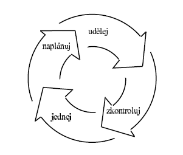
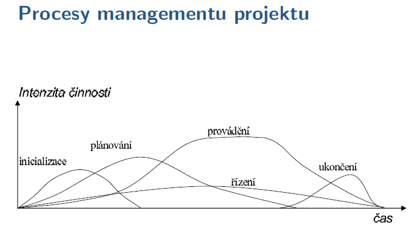
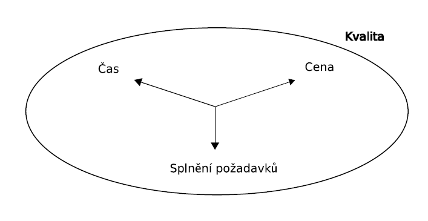
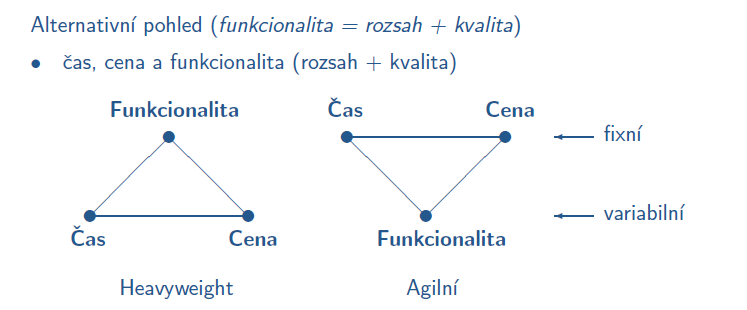
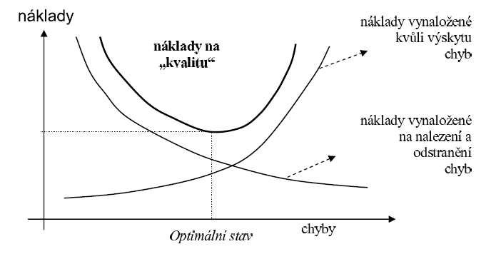
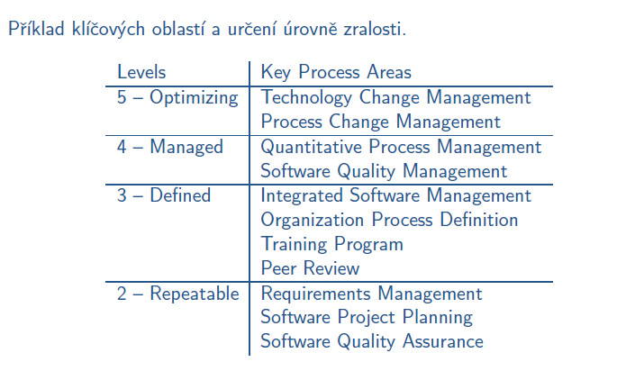
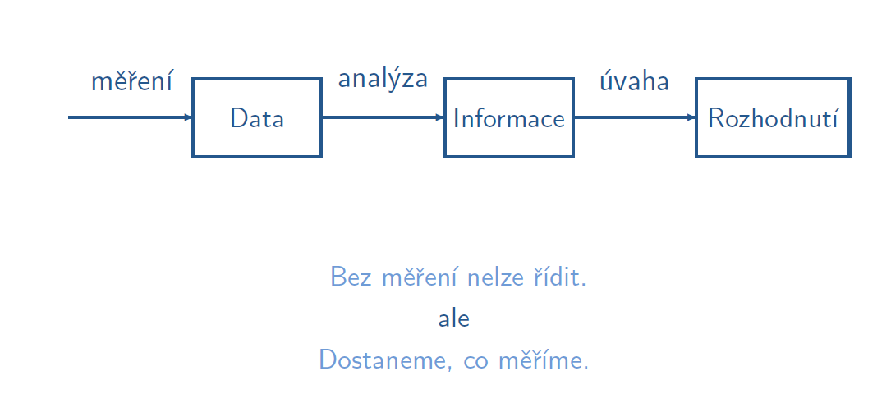

# Jiný úhel pohedu na vývoj SW

## Management SW projektů
- management je proces koordinace práce skupiny lidí, kteří pracují na určitém projektu
- projekt je časově ohraničené úsilí (má začátek i konec), které vyvíjí s cílem vytvořit jedinečný výsledek, který se nějak liší od výsledků podobných projektů (např. výrobek nebo službu)

### Demingův manažerský cyklus
- manažerské prpocesy by měly probíhat v této nekonečné smyčce:
    - plánování (plan) - naplánování zamýšleného zlepšení
    - zavádění (do) - realizace plánu
    - ověření (check) - zhodnocení dosažených výsledků
    - jednání (act) - rozhodnutí, jaké další změny provést pro další zlepšení

    

**Inicializace**
- rozpoznání, že projekt může začít
- získáváme veškeré relevantní informace
    - časový a cenový horizont
    - základní koncepce projektu
    - potenciální rizika
- trvá několik dní až měsíců
- klíčová otázka, Máme se do toho pouštět?
- proč se do projektu pouštět:
    - poptávka na trhu
    - požadavek zákazníka
    - z důvodu prestiže
    - výhody technologie (např. databáze knih v knihovně...)
    - požadavky legislativy

**Plánování**
- vytvoření plánu projektu pro zabezpečení chodu projektu
- definují se požadavky na zdroje, lidi, definuje se kvalita a kvantita práce
- plánování by nemělo být příliš podrobné -> přiměřeně tomu, co jsme schopni v daném časovém horizontu garantovat, že se udělá
- plánování je intenzivní hlavně v začátcích projektu
- vytvořený plán musí schválit všechny skupiny, kterých se týká
- špatný plán je značné riziko pro projekt
- důvody plánování:
    - snížit neurčitost
    - dosáhnout cenovou efektivitu
    - lepší pochopení cílů projektu
    - vytvořit základnu pro sledování a řízení práce
    
Projektový plán
- obsahuje:
    - definice cílů
    - co je potřeba udělat
    - kdo to má udělat
    - kolik to bude stát
    - pro koho je to potřeba udělat
    - techniky, prostředky, jak se to má udělat
    - kdy je to potřeba udělat
    - co když nastane určitá situace, vychytání předvídatelných událostí
    - definice kvality

**Řízení**
- kontrola řízení na základě naměřených výkonů
- preventivní činnosti s cílem předcházet problémům
- shromažďují a rozšiřují se informace
    - o stavu projektu (jak na tom projekt je v porovnání s plánem)
    - postupu projektu (co see dosud udělalo)
    - budoucím stavu a postupu projektu (předpověď vývoje projektu)
- sleduje stav projektu, porovnává a posuzuje se
    - postup dosažený v posledním určeném období (týden, měsíc,...)
    - dosažené výsledky s tím, co je ještě potřeba udělat
    - přiřazení zdrojů (lidé, počítače, auta...)
    - poměr dosažených výseldků a času, který uplynul, rozhoduje se, zda je dosažení cílů reálné
- zajišťuje se řízení změn

**Provádění**
- spotřebuje nejvíce času (úsilí) a peněz
- realizace plánu projektu
- manažer koordinuje přidělování úkolů, stanovení priorit, rozdělování pravomocí, sledování postupu prací na projektu...
- provádění je nejvíce problémová doména 
- vytváří se výsledek

**Ukončení**
- zaznamenají se nové poznatky a zkušenosti a poučení pro budoucí projekty
- ukončí se smlouvy a kontrakty se zákazníky

## Řízení kvality SW projektů
- obvyklý postup při tvorbě SW:
    - co nejrychlejší implementace programu
    - rychlé testování s cílem odhalit chyby
    - odstranit chyby

**Kvalita**
- kvalita není definovaná jako absolutní míra, ale jako stupeň splnění požadavků a služeb
- je to souhrn vlastností nebo charakteristik produktu, které souvisí s jeho schopností splnit požadavky na něj
- kvalitu hodnotí každý jinak - uživatel, provoz, tvůrce a vývojář, manažer

**Parametry SW projektu**
- cena - se snižujícími prostředky klesá kvalita i rozsah; příliš vysoká cena taky ničemu nepomáhá
- čas - málo času, snižuje se kvalita rozsah zadání, roste cena; příliš mnoho času kvalitu ani nic zase už nezvyšuje
- kvalita - vyšší kvalita zvyšuje počáteční náklady, do budoucna je snižuje a naopak
- rozsah - menší rozsah zadání: možnost vyvíjet rychle, levně a s lepší kvalitou
- heavyweight - zákazní volí rozsah a případně kvalitu, vývojový tým určí cenu a čas
- agilní - zákazník volí cenu, čas a kvalitu, vývojový tým určí rozsah

- pozor, neplést kvalitu s funkcionalitou
- příliš mnoho funkcí ve výsledku snižuje kvalitu
- SW bez bych != kvalitní SW

**Normy pro systém zajištění systému**
- vychází se z předpokladu: pokud má organizace kvalitní proces výroby, budou i její výrobky kvalitní
- tento přístup se používá hlavně proto, že v SW inženýrství není jednoduché měřit kvalitu programů pomocí nějaké výstupní kontroly
- existují určité normy, např. ISO 9000
- zhodnocení ISO 9000
    - dává slušný základ pro dobře fungující výrobu
    - zákazník získá určitou představu o organizaci
    - zvyšuje konkurenceschopnost a zlepšuje jméno organizace
    - ale snadno sklouzne k byrokracii
    - vysoká investice pro její zavedení
    - norma se zavádí docela dlouho
- alternativou je CMM
    - používá se v USA pro vyhodnocení vládních dodavatelů SW
    - zjišťuje, zda a jak má firma šanci splnit zakázku
    - má úrovně 1 (0) - 5

    
    
    - není přímo pro SW, proto se zavádí CMMI

## Měření v SW inženýrství
- měření je proces přiřazování hodnot k vlastnostem entit reálného světa
- měření zvyšuje pravděpodobnost, že i přes nejistotu uděláme dobré rozhodnutí
- každé měření musí mít svůj účel

- grafy jsou užitečnější jak raw data

**Typy měření**
- přímé měření - změření rovnou hledaného atributu
- nepřímé měření - odvození z jiných atributů

**Metriky**
- jsou různé, např:
    - velikost, rozsah
    - modularita
    - spolehlivost
    - dostupnost
    - složitost
    - chyby
    - urdžovatelnost
    - úsilí (člověkohodiny)
    - změny požadavků
    - náklady a čas
    - ...

## Softwarový tým

**Role v SW týmu**
- analytik
- architekt
- návrhář
- programátor
- tester
- odborník na zabezpečení kvality
- specialista na údržbu
- management
- podpůrný personál

Je v hodné (obvzlášť v agilních metodikách) aby si jeden člověk vyzkoušel více rolí v týmu
- jednak proto, aby byl popřípadě schopen na nějakou přechodnou dobu zastoupit kolegu který vypadl, ale hlavně proto, aby zjistil které role mu vlastně sedí nejvíc

**Analytik VS programátor**
- Analytik
    - analytici vytvářejí cíle projektu
    - vyžaduje diplomatické vlohy při jednání s lidmi, musí být schopen "vymámit" informace, které potřebuje
    - nemá jasné ohraničení, protože v podstatě on vytváří ty cíle
- Programátor
    - navrhují technické řešení problému, implementují a testují komponenty
    - práce má předem daný cíl
    - výsledky práce jsou okamžitě zřejmé

**Jak poskládat tým**
- správně poskládaný tým připomíná družstvo v kolektivním sportu
- problematické typy v týmu:
    - beran
    - slabý článek
    - dělnická mentalita
    - snaživec

**Vhodná velikost týmu**
- menší tým pracuje efektivněji
- větší tým spotřebuje více času pro komunikaci
- větší tým může projekt dokončit dříve
- větší tým může najít lepší řešení díky většímu objemu znalostí

*Pravidlo jedné místnosti*
- tým, který je v jedné místnosti se dá řídi neformálně, protože lidi si všechno řeknou
- pro větší týmy je nutné zavést písemnou komunikaci

**Přístupy lidí v praxi**
- lidé nemají moc rádi změny, takže preferují spíše konzervativní přístup a neuspět než riskovat s jinou metodou a uspět
- cokoli co ještě neznáme nám přijde příliš složité a nechceme se to učit
- to samo že lidi ignorují nástroje a techniky, které nemají rádi

